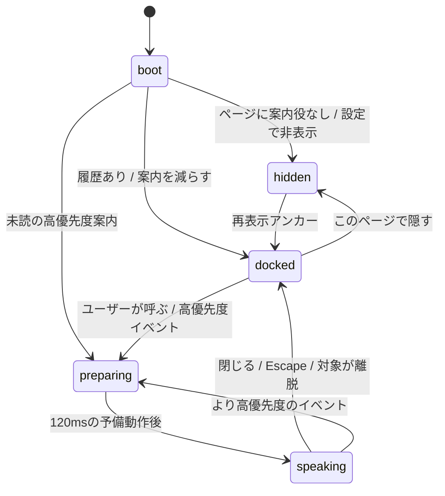

# キャラクター・モーション仕様

## 0. 文書の位置づけ

本書は、「富岡謎解き／繭が遺した地図」の案内役キャラクターを、既存のNext.jsサイトへ実装するためのモーションと状態管理の仕様である。正式なキャラクター名・造形・台詞は未確定のため、本書では役割IDと動作IDのみを固定し、固有名詞やストーリー上の事実を新規に断定しない。

キャラクターは重要情報の唯一の提供手段にしない。主要操作、問題文、進捗、エラーは従来どおりHTMLで提供し、キャラクターは文脈をつなぐ補助層とする。

## 1. 確認済みの現状

以下は2026-07-22の本監査開始時点で、リポジトリに実在を確認した事実である。並行実装で後から追加された素材はこの監査範囲に含まない。

- 依存関係はNext.js 16.2.11、React 19.2.4、Leaflet 1.9.4、Three.js 0.185.1。Lottie、Rive、Framer Motion、GSAPは`package.json`にない。
- `HeroExperience.tsx`は2D Canvasを使い、`IntersectionObserver`が表示領域外と判定したときにRAFを停止する。`prefers-reduced-motion`による静止表示とunmount時のクリーンアップがあるが、`document.visibilitychange`の明示的な購読はない。
- `SpatialRouteCanvas.tsx`はThree.jsを遅延importし、低消費電力renderer、DPR上限、無限RAFなしのフォーカス遷移、Save-Data/低速回線/reduced-motion時の2D既定、WebGL非対応・context loss時の2D復帰、geometry/material/textureの破棄を実装している。
- `CheckpointMap.tsx`はLeafletの地図とHTMLの地点一覧の両方を持つ。地点詳細開閉、Escape、フォーカス復帰、タイル失敗時の文字導線がある。
- `PuzzleExperience.tsx`は`idle/checking/correct/incorrect/error`を持ち、正解時に`completeCheckpoint`を呼ぶ。ヒントは現状、確認なしで開く。
- `progress.ts`は`localStorage`とメモリフォールバックを持ち、`mayu-progress-change`をdispatchする。
- `ArchivePrelude.tsx`は初回用記録開封と省略を持ち、`onComplete(reason)`を受け取れるが、現在の`HeroExperience`は未接続。
- `globals.css`は`prefers-reduced-motion: reduce`で全てのanimation/transitionを1回・0.01ms相当へ縮める。アニメーション完了イベントだけに後続状態を依存させてはいけない。
- `public/`にキャラクター素材はない。既存のWebP 3点と地点SVG 6点は、キャラクターアセットではない。

## 2. 方式比較と採用判断

| 方式 | 適性 | 利点 | リスク | 判定 |
| --- | --- | --- | --- | --- |
| CSS transform/opacity | 高 | 新依存なし、DOMの吹き出しと同期しやすい、GPU合成しやすい | 複雑な造形変形に不向き | **採用**。キャラクター外枠、表情交換、有限の予備動作、吹き出し開閉に使う |
| SVG | 高 | 小画面で鮮明、絹糸の描画や局所的な関節回転に向く | AI生成ラスターからの雑な自動ベクトル化は品質低下 | **条件付き採用**。手修正済みパスの糸・光・アイコンに限定 |
| 透過WebP/AVIFポーズ差分 | 高 | 紙・絹・墨の絵画的質感を保てる | 各フレームのシルエットずれ、デコード量 | **採用**。共通キャンバスサイズ・基準点で書き出し、必要ポーズだけ遅延読み込み |
| スプライトシート | 中 | 複数フレームを1リクエストにできる | 解像度別設計、メモリ上の展開サイズ、フレーム間の生成崩れ | MVPでは不採用。連番画品質を人手で保証できる場合のみ再評価 |
| Lottie | 中 | After Effectsとの往復、ベクトルアニメ | 新runtime、JSON/アセット量、生成絵の質感再現が弱い | 不採用 |
| Rive | 中 | 状態機械と骨格が強力 | 新runtime、制作データと専用QAが必要、現チームの編集パイプライン未確認 | 不採用。運用体制確定後の将来候補 |
| Canvas 2D | 中 | 布・糸のプロシージャル表現 | 吹き出し・フォーカス・画像代替がDOMより複雑、ヒーローに既存RAF | キャラクター本体では不採用 |
| Three.js/WebGL/3D | 低 | 地図空間と同じ奥行きに置ける | 既存地図とGPU/contextを競合、玩具的な質感、WebGL非対応時のコスト | **不採用**。キャラクターは地図3Dから独立したDOM層に置く |
| GSAP/Framer Motion | 中 | 中断可能なspring、タイムライン | 現在の状態数に対し新依存の効果が小さい | 不採用。CSSとReact状態で十分 |

### 採用方式

**DOMのReactコンポーネント + 同一基準点の2D/2.5D透過ポーズ + 有限のCSS transform/opacity + 小さなSVG絹糸**を採用する。新たなライブラリは追加しない。

正式素材がベクトルで保たれている場合は本体もSVGでよい。そうでない場合は無理にベクトル化せず、透過WebPを使う。どちらの場合も、キャラクターのボタン、吹き出し、状態文はDOMに残す。

## 3. モーション原則

1. 動く理由は「発話の予告」「選択対象の指示」「発見」「完了」「エラー」のいずれかとする。
2. ユーザー操作の反応を遅らせない。ボタンはpointer-downで即時に`scale(0.97)`へ変化し、clickで確定する。ナビゲーションを演出待ちにしない。
3. 大きな弾み、顔の左右振動、画面全体の明滅、パララックスは用いない。
4. 姿勢変化は現在値から始め、新イベントが来たら低優先度の動作を即時中断する。
5. 表情やポーズ差分の交換は、同一サイズの透過キャンバスで位置ずれを防ぐ。非対称の印や小道具がある場合はCSSで左右反転しない。
6. 待機は停止が主。有限の呼吸1回を行った後は少なくとも11.3秒静止し、最大3サイクルで完全停止する。
7. ヒーローCanvas又はThree.js地図が動いている間は、キャラクターの自動待機モーションを無効にする。
8. どのモーションも`transform`と`opacity`を主に使う。`top/left/width/height/filter/box-shadow`を毎フレーム変化させない。

## 4. 状態機械

### 4.1 表示状態



`hidden`は重要なエラー文まで非表示にする設定にはしない。重要エラー自体は必ず既存UIで読める状態を保つ。「案内を減らす」は自動発話を停止し、ユーザーが呼んだときとブロッキングエラー時のみ表示する。

### 4.2 ポーズ状態

```ts
type CharacterPose =
  | "normal"
  | "greeting"
  | "thinking"
  | "surprised"
  | "discovery"
  | "happy"
  | "troubled"
  | "caution"
  | "pointing"
  | "map"
  | "waiting"
  | "loading"
  | "error"
  | "clear";
```

状態は視覚のポーズであり、台詞そのものではない。各台詞はAgent HのマイクロコピーIDにより接続する。

### 4.3 イベント優先度

| 優先度 | イベント | 扱い |
| --- | --- | --- |
| 100 | 回答・マップのブロッキングエラー | 現在の自動案内を中断。既存エラー文と二重読み上げしない |
| 90 | 最終クリア | 一度だけ表示。自動消去させない |
| 80 | チェックポイント発見 | 同一地点はバージョン内で1回 |
| 70 | ヒント開示確認 | ユーザー起点。確定/キャンセルまで保持 |
| 60 | 通信中・判定中 | 進行中の場合のみ。完了後すぐ停止 |
| 40 | 初回開封完了、マップの初回説明 | セッション内で繰り返さない |
| 20 | スクロールセクション到達 | ページ内1回。発話中なら破棄 |
| 0 | 待機 | いつでも中断可能 |

キューは「現在の1件 + 待機1件」の最大2件とする。同じ`messageId`は後着で置き換え、古い地点選択イベントを読み上げない。

## 5. 状態別の具体モーション

デスクトップでもモバイルでも移動量は同じ。キャラクターのCSS表示サイズを`1u`とした場合、上下移動は最大で`0.06u`とする。

| 状態 | 使用ポーズ | 動き | duration / 停止 | easing |
| --- | --- | --- | --- | --- |
| normal | normal | 静止。発話がないときの基準 | 常時静止 | - |
| idle breath | normal | `translateY(0 → -1px → 0)` + `scaleY(1 → 1.012 → 1)` | 680msを1回、11.3s以上停止、最大3回 | `cubic-bezier(.22,1,.36,1)` |
| greeting | greeting | 顔を3deg上げ、手/糸レイヤーを展開、基準へ戻す | 420ms + 320ms停止 | ease-out / ease-in |
| thinking | thinking | 視線レイヤーを斜め上へ移動、体を1.5deg傾ける | 240ms進入 + 680ms停止 + 220ms復帰 | ease-out / ease-in-out |
| surprised | surprised | ポーズ差替え + `scale(1 → 1.035 → 1)` | 120ms + 240ms | ease-out |
| discovery | discovery | `translateY(0 → -6px → 0)`。絹糸SVGを`scaleX(0 → 1)` | 480ms、糸は420ms | `cubic-bezier(.22,1,.36,1)` |
| happy | happy | 視線をユーザーへ戻し、手を一度胸元へ | 420ms + 500ms停止 | ease-out |
| troubled | troubled | 横振動はせず、顔を1.5deg下げ、糸を少し緩める | 260ms + メッセージ中停止 | ease-out |
| caution | caution | 吹き出し側へ2px傾け、朱の下線を一度描画 | 180ms + 選択待ち | ease-out |
| pointing | pointing | 指し手レイヤーを肩の定義済み基準点から10deg回転して目標側へ0deg | 280ms + 520ms停止 | `cubic-bezier(.22,1,.36,1)` |
| map | map | 地図レイヤーを`translateY(4px → 0)`、視線を下へ | 320ms + 発話中停止 | ease-out |
| waiting | waiting | 静止。吹き出しの「確認中」だけで状態を示す | 待機中 | - |
| loading | waiting | キャラクターは静止。小さな糸車SVGのみ回転 | 1.2s linear、処理中のみ | linear |
| error | error | シェイクはせず、表情差し替え + 吹き出しの朱枠1回 | 240ms | ease-out |
| clear | clear | `translateY(0 → -8px → -5px)`。糸の軌跡を1回だけ描き、最終フレームで静止 | 全体760ms、糸600ms | `cubic-bezier(.22,1,.36,1)` |

ポーズ差分のクロスフェードは100ms。目の瞬きを無限ループさせない。自動待機のタイマーは`document.visibilityState === "visible"`かつキャラクターがIntersectionObserverで可視の場合のみ再開する。

## 6. 吹き出し同期

### 6.1 発話タイムライン

| 時刻 | キャラクター | 吹き出し | フォーカス/音声 |
| --- | --- | --- | --- |
| 0ms | 現在モーション中断、目標ポーズ開始 | まだ出さない | フォーカスを奪わない |
| 120ms | 予備動作が目標方向を示す | `opacity 0→1`, `translateY(6px→0)`, `scale(.98→1)` | `aria-live`の文字をこのタイミングで一括更新 |
| 300ms | ポーズを保持 | 表示完了 | ユーザー起点でも自動focusしない |
| 閉じる | 基準ポーズへ | 140msで出現元へ戻る | Escapeは呼び出しボタンへfocus復帰 |

文字のタイピング表示は行わない。屋外で読む速度をシステムが決めない。自動発話は重要度に関わらず自動消去させず、「閉じる」「後で見る」「案内を減らす」を提供する。

### 6.2 表示・読み上げ仕様

- 自動発話は`role="status" aria-live="polite" aria-atomic="true"`の共1領域で通知する。
- ブロッキングエラーだけ`role="alert"`相当を検討する。既存の`PuzzleExperience`の`aria-live`と同じ文を二重に読ませない。
- キャラクター画像は`alt=""`とし、表情・動作に重要情報を載せない。案内内容は必ずDOM文字で保持する。
- 呼び出しボタンは`aria-label="案内役を呼ぶ" aria-expanded aria-controls`を持つ。
- 閉じる、後で見る、案内を減らすは全てbutton要素。キーボードのEscapeで吹き出しを閉じる。
- 自動発話でfocusを移動させない。非モーダルのためfocus trapは作らない。

## 7. ページ・操作ごとの連携

### 7.1 ヒーローと記録開封

- `ArchivePrelude` 表示中はキャラクターに別の初回説明をさせない。二つのオンボーディングを競合させない。
- `ArchivePrelude onComplete` を使い、`opened`時だけ`greeting`、`skipped`時は動作なしの短い案内、`returning`時は自動発話なしとする。
- キャラクターはヒーローのCanvas上にfixedで重ねず、コピーとCTAのフロー内にコンパクトなinline行として置く。
- ヒーローの無限モーション数が既に多いため、案内役のidle breathは無効。

### 7.2 概念調査図とThree.js

- キャラクターは`SpatialRouteCanvas` のsceneに加えない。DOM/SVGの既存フォールバックと同じレベルに置く。
- 3Dが`loading`の間、キャラクターは動かさず、既存の`aria-live`ステータスに委ねる。
- WebGL非対応、Save-Data、reduced-motion、context lossでも、案内役の吹き出しとリンク一覧はそのまま機能する。
- リンクの`mouseEnter/focus/touchStart`に連動して毎回話さない。キャラクターは初回の地図使用説明と明示的な呼び出しに限定する。

### 7.3 Leaflet地図

- 初回表示で`map`ポーズをinlineで表示し、地図上の記号か地点一覧を選べることだけを案内する。
- `openCheckpoint(slug, source)`時は視線/指し動作のみ。地点詳細パネルのfocus移動と読み上げを妨げる追加吹き出しは自動で出さない。
- モバイルのキャラクターは`mapShell`上のfixed要素にしない。下側パネル、Leafletズーム、凡例と競合するため、`headingRow`下のinline領域とする。
- タイル失敗時は`troubled`または`error`の表情だけ変え、詳細は現在の`.mapMessage`に委ねる。

### 7.4 謎・ヒント・進捗

- `checking`は`waiting/loading`、`correct`は`discovery`、`incorrect`は`thinking`、`error`は`error`とする。既存の結果文と同じ文面をキャラクターで重複表示しない。
- 正解時のモーションは`completeCheckpoint` 呼び出し完了後に始める。モーションを進捗保存の前提にしない。
- ヒントは、最初の「ヒント1を見る」でのみinline吹き出しに「ヒントを表示」「まだ考える」を出す。これはユーザー起点であるため、操作対象はキーボードで到達可能にする。
- 2回目以降の同じヒントは直接開く。すでに開いたヒントを閉じるときはキャラクターを反応させない。
- 進捗変化は`mayu-progress-change`の現行イベントを利用し、別のpollingやRAFを作らない。

### 7.5 最終回答とクリア

- `FinalAnswerForm` の正解後、クリアUIを先にDOMへ表示し、その後`clear`ポーズを1回実行する。
- クリア演出は760ms以内。終了後は静止し、シェアボタンへfocusを強制移動しない。
- サウンドと振動は実装しない。将来導入する場合は明示オプトインが必要。

## 8. 配置と入力

### 8.1 サイズ・配置

| 文脈 | キャラクター表示 | 吹き出し | ターゲット |
| --- | --- | --- | --- |
| デスクトップinline | 112×136pxを上限 | 280〜340px、最大3短文 | 44×44px以上 |
| デスクトップdock | 56×56pxのバストアップ | 呼び出し元の左上へ開く | 44×44px以上 |
| モバイルinline | 76×92pxを上限 | 横に配置、テキスト幅は最低18ch | 48×48px以上 |
| モバイルdock | 48×48pxのバストアップ | 全幅から16pxずつ内側、ボタンの上に開く | 48×48px |

最初の実装はinline優先とする。fixed dockは、ページがキャラクター用の安全領域を定義できる場合のみ使う。ヘッダー、マップ凡例、ズーム、マップ下側パネル、回答・送信ボタンの上には絶対に重ねない。

### 8.2 タッチ・ポインタ・フォーカス

- キャラクターはdragさせない。地図のpan/pinchとジェスチャー競合させない。
- ボタンは`touch-action: manipulation`。最初のpointer-downで100msの押下フィードバック、移動8pxを超えた場合はスクロールを優先。
- hoverだけで発話を開かない。focusだけでも開かず、Enter/Space又はclickで開く。
- 自動の目線追従は実装しない。ポインター移動を常時追うリスナーとRAFを増やさない。

## 9. reduced-motion、Save-Data、低性能、WebGL非対応

### 9.1 動きを減らす設定

`prefers-reduced-motion: reduce`時は以下を強制する。

- キャラクターの移動、傾き、拡大、糸の伸長、待機、ローディング回転を全て停止。
- ポーズは即時交換。吹き出しは最大120msのopacityのみ。
- 予備動作待ちを0msにし、文を即時表示。
- JavaScriptは`matchMedia` changeを購読し、表示中に設定が変わった場合も進行中の動作を中断し最終状態へ進める。
- 既存`globals.css`がdurationを0.01msへ縮めるため、処理完了を`animationend`のみに依存しない。

### 9.2 Save-Dataと低性能

`navigator.connection?.saveData === true`、`effectiveType` が`slow-2g/2g`、または未読み素材のロード失敗時は`static` tierとする。

- `normal`の基本素材1枚だけを表示し、ポーズ差分をpreloadしない。
- 動作は行わず、吹き出し・閉じる・案内設定は維持する。
- 透過素材が失敗した場合は、繭形のCSS/SVGシンボルと吹き出しだけを表示する。発話と操作を失わない。
- 新たなRAFは0。有限アニメーションは平常時に同時1件まで。
- `document.visibilityState === "hidden"`と非可視時はタイマー、CSS animation、preloadを停止する。

`deviceMemory`や`hardwareConcurrency`は未対応ブラウザがあるため、単独の分岐条件にしない。利用できる場合も、上位表現を無効にする安全側のヒントにだけ使う。

### 9.3 WebGL非対応

キャラクターはWebGLと無関係に動作する。`SpatialRouteCanvas` の`unsupported/context_lost/failed/off`を案内役のエラーとして扱わない。従来の2D地図を正常な第一級フォールバックとし、「立体表示を試す」ボタンはそのまま利用可能にする。

## 10. 設定と表示履歴

進捗の`mayu-no-chizu-progress-v1`と混ぜず、別キーで保存する。答え、入力、地理位置、発話内容自体は保存しない。

```ts
const CHARACTER_PREFS_KEY = "mayu-character-guide-v1";

interface CharacterPreferences {
  mode: "full" | "reduced";
  seen: string[]; // ストーリーを含まない定型messageIdのみ
  version: 1;
}
```

- `mode: reduced`は「案内を減らす」。呼び出し時と重要エラー時のみ。
- `seen`は最大40件。コピーバージョンをIDに含め、正式台詞改定時に必要な案内だけ再表示できるようにする。
- localStorageが使えない場合はメモリに保持。ページの主要操作は失敗させない。
- ユーザーが「後で見る」を選んだメッセージは`seen`に入れないが、同一ページセッション内で自動再表示しない。

## 11. 実装インターフェース案

コピーや正式アセットをモーションロジックから分離する。

```ts
type GuidePriority = 0 | 20 | 40 | 60 | 70 | 80 | 90 | 100;

interface GuideMessage {
  id: string;
  pose: CharacterPose;
  priority: GuidePriority;
  text: string;
  announce?: "polite" | "assertive" | "off";
  actions?: Array<{ id: string; label: string }>;
}

interface CharacterGuideProps {
  message: GuideMessage | null;
  placement: "inline" | "dock";
  busy?: boolean;
  onAction?: (actionId: string) => void;
  onDismiss?: (reason: "close" | "later" | "escape") => void;
  onReduceGuidance?: () => void;
}
```

`CharacterGuide` はcontrolled presentational component、`useCharacterGuideMachine` は優先度・履歴・タイマーを担当する。各ページはイベントとアクションを所有し、キャラクターコンポーネントが謎の正解や地点情報を所有しないようにする。

### 提案する新規ファイル

| ファイル | 責務 |
| --- | --- |
| `src/components/character/CharacterGuide.tsx` | DOM、画像レイヤー、吹き出し、button、aria |
| `src/components/character/CharacterGuide.module.css` | 配置、有限モーション、reduced-motion、コントラスト |
| `src/components/character/useCharacterGuideMachine.ts` | 優先度、キュー、履歴、visibility、クリーンアップ |
| `src/data/character.ts` | 仮設定とアセット対応表。正式決定で差し替え可能 |
| `src/data/character-dialogue.ts` | Agent Hが管理する台詞IDと文字。モーションと分離 |
| `public/character/` | バージョン付きの採用済みWebアセットのみ |

### 既存ファイルの統合点

- `HeroExperience.tsx`: `ArchivePrelude onComplete`をガイドイベントへ接続し、inline案内役を配置。
- `InteractiveRoute.tsx`: 初回地図説明のみ。リンクhover/focusでの発話は追加しない。
- `CheckpointMap.tsx`: map state、初回説明、地点選択の視線差分を連携。地点データはガイドにコピーしない。
- `PuzzleExperience.tsx`: resultとヒント確認を連携。保存完了を先に行う。
- `FinalAnswerForm.tsx`: 正解後のみclearイベント。
- `globals.css`: 色の追加が必要な場合も既存の墨緑、古紙、金、朱を再利用し、新しい彩度の高いアクセントを増やさない。

## 12. アセット契約と性能予算

### 12.1 アセット契約

- すべてのポーズは同一のキャンバス比率、足元基準線、頭頂余白、糸の接続点を使う。
- 2xラスターサイズは主表示が最大160pxなら最大320px。不要な1024px原画を本番配信しない。
- 原画と本番最適化品のフォルダを分け、`public/character/`には採用済み最適化品のみを置く。
- 画像内に台詞、地点名、謎の答えを書き込まない。
- 共通の識別要素を各ポーズで目視確認し、顔、手、左右、小道具の生成崩れを不採用にする。

### 12.2 転送・メモリ予算

| 対象 | 予算 |
| --- | --- |
| 初回に必要な基本キャラクター画像 | 80KB以下 |
| 初回に追加読込みするgreeting/normal差分合計 | 150KB以下 |
| 後続の各1ポーズ | 45KB以下を目標、100KBを上限 |
| キャラクター全Webアセット | 450KB以下 |
| SVG糸・シンボル | 各15KB以下 |
| キャラクター機能の新規client JS | gzip 12KB以下を目標 |
| キャラクター周辺DOM | 35ノード以下、吹き出しアクション追加時も50未満 |
| レイアウトシフト | CLSに寄与しない。幅・高さ/aspect-ratioを予約 |
| 同時モーション | 有限1件。clearの糸を含めても最大2レイヤー |
| 新規RAF | 0 |

## 13. クリーンアップ要件

`useCharacterGuideMachine` はunmountで以下を必ず解放する。

1. idleの`setTimeout`、予備動作の`setTimeout`、閉じる遷移の`setTimeout`
2. `matchMedia("(prefers-reduced-motion: reduce)")` changeリスナー
3. `navigator.connection` changeリスナー
4. `visibilitychange`リスナー
5. `IntersectionObserver`
6. documentのEscapeリスナー
7. `storage`イベントを購読する場合はそのリスナー
8. 進捗イベントを直接購読する場合は返却されるunsubscribe

処理中のアクションcallbackをキューの永続履歴に入れない。ページ離脱時のヒント確認はキャンセルとして終了し、離脱後にstate更新しない。

## 14. 実装・QA順序

1. Agent E/F/Hの採用アセット、仮名管理、台詞IDを確定。
2. `CharacterGuide` の静止inline版だけを作り、キーボード、ターゲット、吹き出し幅を検証。
3. 表示状態機械、履歴、案内を減らす、Escapeを実装。
4. greeting/thinking/discovery/error/clearの有限モーションを追加。その他は品質検証後に追加。
5. `ArchivePrelude`、`PuzzleExperience`、`FinalAnswerForm`の順で連携。
6. Leafletにはinline版だけを連携し、ズーム・凡例・パネルに重ならないことを先に確認。
7. Three.jsあり/2D/WebGL非対応で同じ案内導線が使えることを確認。
8. 390×844、375×667、768×1024、1440×900でキャラクターなし/静止/吹き出し/アクション付きの全状態を確認。
9. reduced-motion、Save-Data、2G相当、画像404、localStorage例外、WebGL context lossを確認。
10. lint、`tsc --noEmit`、build、実画面操作、コンソール・メモリリスナー数を確認。

### 操作QAチェック

- 記録を開く→案内が1回だけ出る→閉じる→再読込みで強制表示しない
- 記録開封を省略→ナビゲーションを遅らせない
- マップ地点選択→詳細パネルのfocusとEscape復帰を維持→案内役が重ならない
- ヒントを見る→確認の「まだ考える」→ヒントを開かない→元のボタンが使える
- ヒントを見る→「表示」→ヒントDOMが表示→同じ確認を繰り返さない
- 正解→進捗保存→発見モーション→キャラクター非表示でも進捗が残る
- 不正解→入力値を残す→操作をロックしない
- エラー→キャラクター画像をブロックしてもHTMLエラー文と再試行導線が利用可能
- 案内を減らす→ページ遷移後も保持→明示的に呼ぶと開く
- reduced-motionを実行中に切替→動きを即停止→文とボタンは残る
- 3D表示を切る/WebGL loss→キャラクターと2D地図の操作は継続
- キーボードTab/Shift+Tab/Enter/Space/Escapeで全操作可能
- 200%ズーム、大きなテキストで吹き出しとアクションが切れない

## 15. 完了条件

- 新規依存なしで実装されている。
- キャラクターがThree.js/Leaflet/Canvasのpointer、touch、GPU、RAFと競合しない。
- キャラクターを非表示、画像ブロック、スクリプトエラーにしても主要機能が成立する。
- モバイルで地図パネル、回答ボタン、ヘッダー、ブラウザの安全領域を隠さない。
- 呼び出しボタン、閉じる、後で見る、案内を減らす、ヒント確認がキーボードとタッチで操作できる。
- reduced-motion/Save-Data/画像失敗/WebGL非対応で静止案内とDOM文字が機能する。
- 自動発話の重複、focusの強制移動、動作待ちのナビゲーションがない。
- キャラクターの状態変化が進捗や答えの保存より先に実行されない。
- 実画面でPC/モバイル/reduced-motion/2Dフォールバックを最低2巡批評・修正している。
